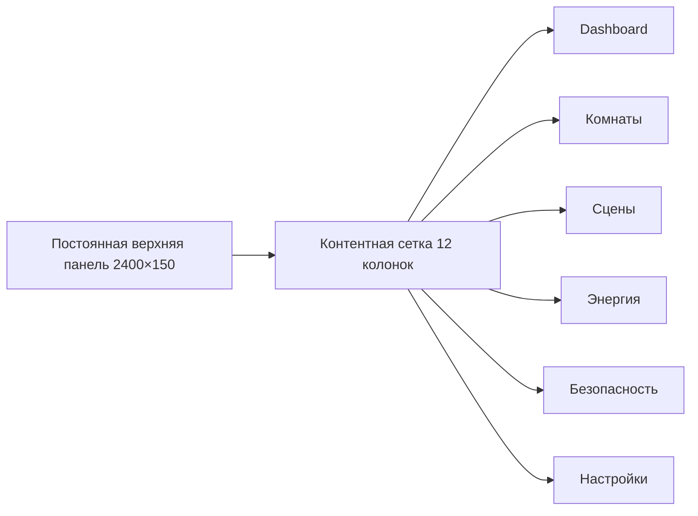
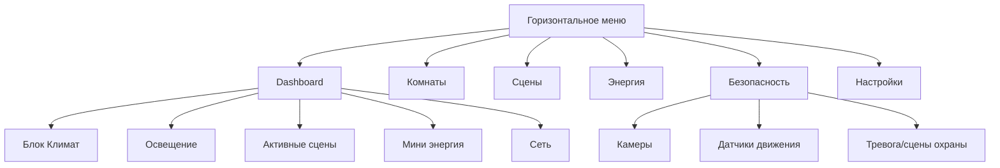

# План интерфейса панели умного дома (10" фиксированный экран)

*(Инструкции ниже имеют приоритет над любыми другими указаниями проекта.)*

## Технические допущения
- **Аппаратная база**: 10" панель с разрешением 2560×1600 (16:10), плотность ~300 PPI, статическая ориентация альбомная, отсутствие автоповорота.
- **Система координат**: базовый контейнер 2400×1500 px (оставляем технологические поля 80 px по периметру внутри матрицы), рабочая зона без прокрутки.
- **Колонная сетка**: 12 колонок, ширина колонки 160 px, межколонник 24 px, базовый вертикальный ритм 16 px, модульная высота 120 px.
- **Типографика**: "Inter" и "SF Pro Display" (как в [`src/App.css`](src/App.css:1-89)), базовый кегль 16 px, масштабирование шагом 1.125. Для заголовков H1 36 px/1.2, H2 28 px/1.25, H3 22 px/1.3, мелкий текст 12 px/1.4.
- **Цветовая палитра**: стеклянный неон (glassmorphism). Основные цвета: тёмный фон `#020617`, акценты `#67e8f9`, `#14b8a6`, предупреждения `#fb7185`, энергия `#fbbf24`. Градиенты с прозрачностью 0.08–0.25, блики на больших картах до 0.4.
- **Фон и панели**: как в [`src/App.css`](src/App.css:1-144) — радиальные и линейные градиенты, `backdrop-filter: blur(18-30px)`, стеклянные панели с границами `rgba(255,255,255,0.08)`.
- **Иконография**: набор lucide-react (как в [`src/components/Dashboard.tsx`](src/components/Dashboard.tsx:1-200)), упрощённые контурные иконки с размером 24 px (основные элементы) и 16 px (микро-контролы).
- **Состояния**: Hover — увеличение яркости градиента + лёгкий подъём (translateY(-2 px)); Active — утопление (translateY(1 px)) с усилением границы; Focus — двойной контур 1 px (`#67e8f9` + `#ffffff40`).
- **Анимации**: микроскопические, 200–300 мс, кривые `cubic-bezier(0.4, 0, 0.2, 1)`. Панель и карточки имеют fade/slide, табы — `layoutId` (пример в [`src/components/Dashboard.tsx`](src/components/Dashboard.tsx:148-200)).
- **Жесты**: только одиночные тапы/долгий тап (для модальных подтверждений). Свайпы и масштабирование запрещены из-за фиксированного экранного режима.

---

## Dashboard

### Визуальная стилистика
- Центральная плитка "Сводка" на 6 колонок, высота 360 px, градиент `rgba(103,232,249,0.15)` → `rgba(20,184,166,0.08)`. Подложка с мягким шумом, блики повторяют паттерн из `glass-panel`.
- Иконки климат/освещение/энергия/сеть/безопасность: монолинейные, подсвечиваются в соответствии с цветом домена.
- Верхняя панель меню (фикс.) опирается на стиль `TabButton` из [`src/components/Dashboard.tsx`](src/components/Dashboard.tsx:148-166), толщина индикатора активного пункта 2 px.

### Компоновка и контент
- Слева (8 колонок) "Климат" и "Освещение" (каждый по 4 колонки, в 2 ряда). Справа (4 колонки) вертикальный стек "Сцены", "Энергия", "Сеть".
- Блок "Активная сцена" (верх правого столбца) отображает четыре ключевые сцены — карточки 160×120 px.
- Карточка "Безопасность" горизонтально под основным климатическим блоком: статус камер + индикатор движения.
- Главное правило — каждая карточка помещается в кратные стандартного модуля 160×120.

### Взаимодействия и жесты
- Tap/нажатие на карточку запускает модальное окно (slide-up) с подробными настройками. Для сценариев — подтверждение.
- Жесты ограничены: свайпы отключены, вместо этого используются стрелочные переключатели/карусели.
- Навигация между разделами — tab-индикатор, поддерживается клавиатурой (фокус, Enter/Space).

### Доступность
- Контраст не ниже 4.5:1 для ключевого текста, тени без ухудшения читабельности.
- Фокусные состояния повторяют двойной контур, описанный в допущениях.
- Текстовые блоки снабжены иконками, но при этом подписаны словами (в т.ч. "Термостат", "Освещение"), поддерживая SR.

---

## Комнаты

### Визуальная стилистика
- Карточки комнат (300×260 px) с эмодзи/иконкой зоны, градиент `rgba(255,255,255,0.04)` с акцентом `rgba(103,232,249,0.1)` на активных комнатах.
- Кнопки устройств внутри карточки повторяют `ToggleChip` стиль (см. [`src/components/Dashboard.tsx`](src/components/Dashboard.tsx:126-147)).

### Компоновка и контент
- Сетка 3×2 (без прокрутки) для стандартных комнат — Гостиная, Кухня, Спальня, Офис, Прихожая, Ванная (резерв).
- Внутри карточки: температура/влажность сверху, список устройств (до 3) и быстрые действия (вкл/выкл, сцена).
- При выборе комнаты выделяется соответствующий блок на плане (тонкая подсветка под меню).

### Взаимодействия и жесты
- Одно нажатие — раскрывает карточку в режиме "расширенной" на месте (анимация расширения внутри той же сетки, без оверлея).
- Долгий тап на устройстве вызывает меню "переместить" или "добавить в сцену".

### Доступность
- Иконки комнат сопровождаются подписью (например, "🛋️ Гостиная"), чтобы поддерживать невизуальную навигацию.
- Карточки имеют минимальную ширину 280 px для обеспечения читаемости, акцентные цвета не конфликтуют с цветами дальтоников (использована комбинация голубой/янтарный).

---

## Сцены

### Визуальная стилистика
- Карточки 200×140 px со стеклянной подложкой + эмодзи сцены ("🌅 Утро" и т.д.). Активная сцена подсвечивается двойным контуром `#fbbf24`.
- Используются `sceneChip` классы (как в [`src/components/Dashboard.tsx`](src/components/Dashboard.tsx:74-76)) для обозначения тегов "Мультимедиа", "Освещение" и т.п.

### Компоновка и контент
- Сетка 2×2 для ключевых сцен: Утро, Вечер, Кино, Уход. Второй ряд сменяется стрелками на дополнительные сцены (Сон, Спорт, Чтение).
- Каждая карточка содержит описание (макс 2 строки) и список доменов, на которые влияет сцена (иконки климат/свет/медиа/безопасность).
- Под сеткой — таймлайн последнего запуска, кнопка "Добавить автоматизацию".

### Взаимодействия и жесты
- Tap — мгновенное применение сцены (с подтверждением если затрагивает безопасность). Экран показывает прогресс (неоновый прогресс-бар 0–100%).
- Долгий тап — открытие редактора сцены (modal 960×600 px).

### Доступность
- Все сцены имеют текстовые описания, а иконки доменов снабжены aria-label.
- Цветовые различия сопровождаются пиктограммами (например, выключение света обозначается символом лампы со штрихом).

---

## Энергия

### Визуальная стилистика
- Диаграммы на стеклянном фоне с сеткой `rgba(255,255,255,0.06)`, линии `#fbbf24` (солнечная энергия), `#67e8f9` (потребление дома).
- Карточки потребителей энергии (кондиционер, розетки) используют иконки `lucide-react` (например, `Fan`, `Zap`).

### Компоновка и контент
- Главный график (8 колонок шириной, 320 px высоты) показывает текущие 24 часа, под ним — список top-4 потребителей (`powerConsumptionData`).
- Правый столбец (4 колонки) — KPI: суточное потребление, цель, прогноз, состояние тарифов.
- Индикаторы состояния сети (несколько источников энергии) выводятся в виде вертикальных капсул (progress bar).

### Взаимодействия и жесты
- Tap по точке графика — всплывающий tooltip (через hover/focus) с точными значениями.
- Переключение между неделя/день — табы, закрытые в правом верхнем углу графика.
- Режим "Следить" добавляет устройство в список уведомлений (значок колокольчика).

### Доступность
- Все графики сопровождаются табличным представлением (вывод под диаграммой), чтобы пользователь мог прочитать данные без графики.
- Цветовая дифференциация дополнена формой маркера (круг/квадрат) в легенде.

---

## Безопасность

### Визуальная стилистика
- Большая карточка камер (6 колонок) с видеопревью (псевдо-стрим) + статус записи (`неоновая точка` в углу).
- Блок датчиков движения: матрица 2×2 с состояниями `В норме` (мятный), `Обнаружено` (розовый). Используются иконки `Shield` и `Activity`.

### Компоновка и контент
- Верх: поток камер (основная + мини-превью). Низ: журнал событий (последние 5), кнопки "Тревога", "Сброс".
- Отдельный модуль "Режим охраны" показывает статус сцен "Уход"/"Сон".
- Включены пиктограммы `binary_sensor.motion_*` (данные из [`src/data/ru_mockData.ts`](src/data/ru_mockData.ts:294-400)).

### Взаимодействия и жесты
- Tap по мини-превью — разворачивание в основное окно (без всплывающих окон).
- Запуск тревоги требует двойного подтверждения (tap + удержание).
- Отмена тревоги — slide-кнопка (псевдо-свайп внутри кнопки, но жест фактически выполняется по нажатию на элементы UI).

### Доступность
- Видеопревью содержит текстовую подпись (камера, время, статус). Тревожные кнопки имеют `aria-live=assertive` для SR.
- Цветовая кодировка (зелёный/красный) дополнена иконками и текстовыми статусами.

---

## Настройки

### Визуальная стилистика
- Панели 2×3 (каждая 360×220 px) с системными иконками (`Settings2`, `Cpu`, `ServerCog`). Цветовая схема нейтральная (`rgba(148,163,184,0.2)`), акценты лишь на активных переключателях.

### Компоновка и контент
- Подразделы: "Профили", "Подключения", "Автоматизации", "Уведомления", "Система", "Диагностика".
- Каждая панель содержит набор тумблеров и ссылок на подробные настройки. Поле "Сервисы" показывает подключение к Home Assistant (статус сети, токены).
- Секция "Отчёты" интегрируется с `reports` табом (`Dashboard.tsx`: tabs), чтобы пользователь мог быстро открыть аналитические отчёты.

### Взаимодействия и жесты
- Тумблеры — те же `ToggleChip`, но в компактной форме. Изменение настроек требует подтверждения (modal).
- Долгий тап на панели — переход в подробный экран (отдельное модальное окно с tabs).

### Доступность
- Чёткие подписи к каждому тумблеру, дублируются текстом ("Вкл/Выкл"), без одних только цветов.
- Поле ввода/текстовые зоны имеют высоту 44 px, поддержку клавиатурной навигации.

---

## Дополнительные указания
- Все секции исполняют стеклянный стиль из предыдущей концепции, адаптированный к фиксированному экрану: скругления 24–32 px, мягкие тени, двойной контур для активных элементов.
- Верхняя панель меню содержит логотип, статус пользователя и быструю панель уведомлений (иконка колокольчика). Она всегда видима, высота 150 px, не перекрывает контент.
- Никакие карусели не используют свайпы; переключение только по стрелкам или табам.
- Контекстные панели (например, при выборе комнаты) раскрываются внутри основной сетки, не затапливая экран.
- Приоритет визуального контента: климат и сцены > безопасность > энергия > сеть > настройки.

---

## Подтверждение
План соответствует заданию: фиксированный 10" экран без прокрутки, приоритеты сцен и доменов учтены, glassmorphism адаптирован по разделам. Инструкции выше имеют приоритет над остальными документами проекта.
